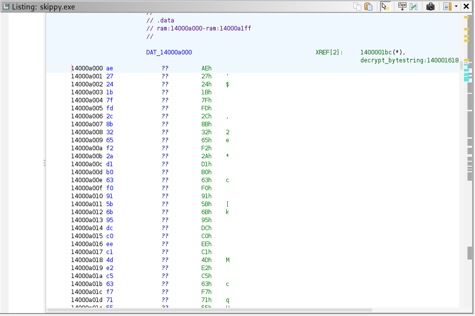

## skippy - DUCTF 2025 Write-up


**Challenge:** skippy
**Category:** rev
**Points:** 100
**Author:** MinousE3

### Introduction
In this challenge, we’re given a single file: a Windows executable named [`skippy.exe`](assets/files/skippy.exe). The description reads:

*"Skippy seems to be in a bit of trouble skipping over some sandwiched functions. Help skippy get across with a hop, skip and a jump!"*

Our task is to analyze the executable, understand its behavior, and recover the correct flag.

Let’s begin by opening the binary and taking a closer look.

### Analyzing the [`skippy.exe`](assets/files/skippy.exe) File
To begin the reverse engineering process, I used Ghidra to analyze the Windows executable skippy.exe.

The starting point for the analysis is the `main` function. It begins by declaring two local character buffers, `local_28` and `local_48`, each of size 32. These buffers are populated with hardcoded signed byte values. The buffer `local_28` is initialized with a series of negative values and terminated with a `0x40`, which likely acts as a sentinel or delimiter. Similarly, `local_48` is filled with another sequence of negative values, also ending in 0x40. Although the buffers `local_28` and `local_48` are 32 bytes long, only the first 16 signed bytes (i.e., those preceding the `0x40` sentinel at index 16) are processed by `decryptor` and ultimately used as the AES key and IV. The remaining bytes after the sentinel are ignored. These two buffers are then passed into a function named `sandwich`, and subsequently, both are provided to a function called `decrypt_bytestring` as key and IV.

The main function looks like this:

```c
int __cdecl main(int _Argc,char **_Argv,char **_Env)

{
  char local_48 [32];
  char local_28 [32];
  
  __main();
  local_28[0] = -0x1a;
  local_28[1] = -0x2a;
  local_28[2] = -0x2e;
  local_28[3] = -0x20;
  local_28[4] = -0x20;
  local_28[5] = -0xe;
  local_28[6] = -0x42;
  local_28[7] = -0x18;
  local_28[8] = -0x30;
  local_28[9] = -0x36;
  local_28[10] = -0x42;
  local_28[0xb] = -0x3c;
  local_28[0xc] = -0x16;
  local_28[0xd] = -0x1a;
  local_28[0xe] = -0x30;
  local_28[0xf] = -0x42;
  local_28[0x10] = 0x40;
  sandwich(local_28);
  local_48[0] = -0x2a;
  local_48[1] = -0x3e;
  local_48[2] = -0x24;
  local_48[3] = -0x32;
  local_48[4] = -0x3e;
  local_48[5] = -0x1c;
  local_48[6] = -0x22;
  local_48[7] = -0x22;
  local_48[8] = -0x22;
  local_48[9] = -0x22;
  local_48[10] = -0x22;
  local_48[0xb] = -0x22;
  local_48[0xc] = -0x22;
  local_48[0xd] = -0x22;
  local_48[0xe] = -0x22;
  local_48[0xf] = -0x22;
  local_48[0x10] = 0x40;
  sandwich(local_48);
  decrypt_bytestring((longlong)local_28,(undefined8 *)local_48);
  return 0;
}
```

The `sandwich` function applies a sequence of operations: first `stone`, then `decryptor`, and then `stone` again. However, static analysis of `stone` reveals that it does not modify the buffer — it merely prints diagnostic output. The actual transformation occurs in `decryptor`, which performs a simple bitwise right shift (`>> 1`) on each byte of the buffer. Since AES-128 uses only the first 16 bytes of both the key and IV, the buffers are effectively truncated at the `0x40` sentinel, which is not part of the actual data. Therefore, `sandwich` is simply a misleading wrapper that obfuscates the intent of a basic decoding step.

```c
void sandwich(char *param_1)
{
  stone(param_1);
  decryptor((longlong)param_1);
  stone(param_1);
  return;
}
```
It's also important to note that although the original buffers (`local_28` and `local_48`) are 32 bytes in size, only the first 16 bytes are used as the AES key and IV, respectively — consistent with AES-128 requirements. The sentinel value `0x40` acts as a delimiter and is not part of the final key or IV.

Next, the `decrypt_bytestring` function uses these processed values to perform the actual decryption. It copies 96 bytes of ciphertext from the data segment (`DAT_14000a000`) into a local buffer, initializes the AES context using `AES_init_ctx_iv`, and decrypts the data in AES-CBC mode. After decryption, `stone` is once again invoked — but as previously established, this function has no effect and can be ignored. Finally, the result is printed using `puts`.

```c
void decrypt_bytestring(longlong param_1,undefined8 *param_2)
{
  char local_168 [72];
  undefined8 uStack_120;
  undefined1 local_f8 [200];
  char *local_30;
  undefined8 local_28;
  ulonglong local_20;
  
  local_20 = 0x60;
  local_28 = 0x60;
  uStack_120 = 0x140001601;
  local_30 = local_168;
  memcpy(local_30,&DAT_14000a000,0x60);
  AES_init_ctx_iv((longlong)local_f8,param_1,param_2);
  AES_CBC_decrypt_buffer((longlong)local_f8,(undefined8 *)local_30,local_20);
  local_30[local_20] = '\0';
  stone(local_30);
  puts(local_30);
  return;
}
```

### Method
After reverse engineering `skippy.exe` and tracing its execution flow, we discovered that the program decrypts a 96-byte ciphertext using AES-128 in CBC mode. The AES key and IV are not stored in plaintext—they're obfuscated and transformed through a function called `sandwich` before being used.

Inside the `main` function, two arrays (`local_28` and `local_48`) are defined, each consisting of 16 signed byte values followed by a `0x40` sentinel. These arrays represent the raw AES key and IV, respectively:
```
local_28 = {-0x1a, -0x2a, ..., -0x42, 0x40}; // key
local_48 = {-0x2a, -0x3e, ..., -0x22, 0x40}; // iv
```

Both arrays are passed into the `sandwich function`, which calls an inner function named `decryptor`. The actual transformation performed is quite simple: each byte is right-shifted by one bit (`>> 1`). Since the original values are negative (due to being signed), we first convert them to unsigned 8-bit integers using `b & 0xff` before applying the shift.

The ciphertext, located in the `.data` segment at `DAT_14000a000`, is exactly 96 bytes long.


We extract it and convert it to a hex string for decryption.
```
ae27241b7ffd2c8b3265f22ad1b063f0915b6b95dcc0eec14de2c563f7715594007d2bc75e5d614e5e51190f4ad1fd21c5c4b1ab89a4a725c5b8ed3cb37630727b2d2ab722dc9333264725c6b5ddb00dd3c3da6313f1e2f4df5180d5f3831843
```

To replicate this logic, we wrote a Python script that re-implements the transformation and performs AES decryption. You just need to paste the ciphertext in hex format into the script.

Here's the script [`skippy_solve.py`](assets/files/skippy_solve.py):
```python
from Crypto.Cipher import AES

# Step 1: Raw key and IV before sandwich()
key_bytes = [
    -0x1a, -0x2a, -0x2e, -0x20, -0x20, -0x0e, -0x42, -0x18,
    -0x30, -0x36, -0x42, -0x3c, -0x16, -0x1a, -0x30, -0x42
]

iv_bytes = [
    -0x2a, -0x3e, -0x24, -0x32, -0x3e, -0x1c, -0x22, -0x22,
    -0x22, -0x22, -0x22, -0x22, -0x22, -0x22, -0x22, -0x22
]

# Function to simulate decryptor() logic
def decode_param(arr):
    return bytes([(b & 0xff) >> 1 for b in arr])

key = decode_param(key_bytes)
iv = decode_param(iv_bytes)

# Step 2: Paste the ciphertext here (copied from the binary data section)
ciphertext_hex = """
ae27241b7ffd2c8b3265f22ad1b063f0915b6b95dcc0eec14de2c563f7715594007d2bc75e5d614e5e51190f4ad1fd21c5c4b1ab89a4a725c5b8ed3cb37630727b2d2ab722dc9333264725c6b5ddb00dd3c3da6313f1e2f4df5180d5f3831843
"""

ciphertext_hex = ciphertext_hex.strip().replace("\n", "").replace(" ", "")
ciphertext = bytes.fromhex(ciphertext_hex)

# Step 3: Decrypt the ciphertext
cipher = AES.new(key, AES.MODE_CBC, iv)
decrypted = cipher.decrypt(ciphertext)

# Step 4: Display the result
try:
    plaintext = decrypted.rstrip(b"\x00").decode()
except UnicodeDecodeError:
    plaintext = decrypted

print("[+] Flag (raw):", plaintext)
```

### **Output**
```
┌──(minouse3㉿kali)-[~]
└─$ python3 skippy_solve.py  
[+] Flag (raw): DUCTF{There_echoes_a_chorus_enending_and_wild_Laughter_and_gossip_unruly_and_piled}
```

```
flag: DUCTF{There_echoes_a_chorus_enending_and_wild_Laughter_and_gossip_unruly_and_piled}
```
