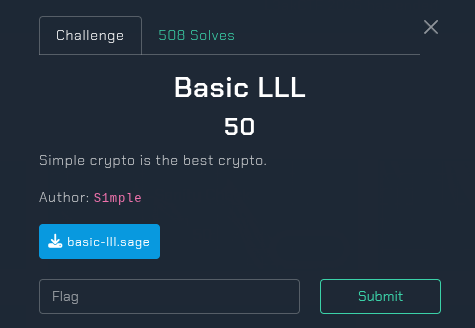

## Basic LLL - L3akCTF 2025 Write-up



**Challenge:** Basic LLL
**Category:** Crypto
**Points:** 50
**Author:** MinousE3

### Introduction
In the cryptography challenge “Basic LLL,” we are given a Sage script [`basic-lll.sage`](assets/files/basic-lll.sage), that simulates RSA key generation using two large primes `p` and `q`, then encrypts a message using the RSA algorithm. What makes this challenge interesting is the presence of an auxiliary value `k`, computed as `k = x * y + a * p`, where `x` is a small integer and `y` is a randomly chosen 256-bit number. While the RSA modulus `n = p * q` is publicly known, the value `p` is normally kept secret — but in this case, it is partially exposed through the way `k` is constructed. The goal of the challenge is to exploit this structure in order to recover `p`, factor `n`, and decrypt the given RSA ciphertext `c` to obtain the original flag.

### Analyzing the [`basic-lll.sage`](assets/files/basic-lll.sage) File
To better understand what’s going on, let’s look at the full content of the provided file [`basic-lll.sage`](assets/files/basic-lll.sage):

```bash
def generate():
    p = random_prime(2^1024, lbound=2^1023)
    x = randint(1, 2^16)
    y = randint(1, 2^256)
    a = randint(2^1023, 2^1024)
    q = random_prime(2^1024)
    n = p * q
    return x, a, y, n, p

x, a, y, n, p = generate()
k = x * y + a * p
e = 65537
print(f"x = {x}")
print(f"a = {a}")
print(f"n = {n}")
print(f"k = {k}")

m = b'L3AK{<Redacted>}'
flag = int.from_bytes(m, byteorder='big')
c = pow(flag, e, n)
print(f"c = {c}")

'''
x = 54203
a = 139534605978199350449870348663594126359773246906906418074945064315708552206952695156472923968554408862426942537522569163756593332601739006413404986641247624386522169136633429464195370373009454673819688653512479919153332504769835621608305089536245284458011218876474599059184828911301976396971466368457267831713
n = 12909957208634846878337953184362917609451224905637563117148705894888627434882610771803126452504238664471840340722310690445704139825753660053450331966698205860077330083433391290469454571152366284661640391190008258576947840075212180965738595761925516686689797153224716140447515370184846067654512660266993573880775530634588475842083212670090415716860925772115834314563453955681012820960922892736520042799257599331942717963921797157341454739255402633419216921702659541513141028779948257696746810146033667942181244847983610429227387863821351416689099862418820999250005071861968501333899759899513283613946626413863922604073
k = 24474689179117620559916890529357882261493825442019850679598519081287156822984032786458479363048845076078220151760752906879055457682971398809768604333650029141164831566127754715775782823279839766009120238777348170982471623193652714921064243946655726118484337862412275391615166714375745390409664610412156281691721978732319253694004232933156865189917761521085635692596755802274763409871937618659197646864593743015558828475450200247766980008744319676783526158213931581034209356092026748307730083927225249093712227456855972520574747646873074625455900058136458828591335711677741591552501530047335481073272381631524755666119
c = 11185314040721202177044508537272244264288033276739579716599246665772965854249656943282002695659011960313245796587834222078633141747802754149848079632693280265262199729548775879612614113828267471629389698999657686858047585254549801752634049341009476489652456620836030696102393122618822021082792763848220677651608135328630551380537642144416978955966827336280510774254681264136102268730343853559751471313539810499170669215479225898738527316798768622089152851154959800113070358637984124299357803777453137311143202502153552192970732744885328421213081964363890280109214401691255867427694709196120824176729643585687319321473
'''
```

This script starts by generating two large prime numbers, `p` and `q`, and multiplies them together to form the RSA modulus `n`. This is standard in any RSA setup. However, the challenge introduces a twist by calculating a new value `k = x * y + a * p`, where `x` is a small random integer (up to 16 bits), `y` is a 256-bit random number, and `a` is a large random number, approximately the same size as `p`.

The result is that `k` becomes a kind of "leaky" container — it mixes together a small, manageable term `x*y` with a much larger term `a*p`. Since `a` and `x` are known and `k` is public, this gives us a clever opportunity to isolate and recover `p`.

The rest of the script follows a classic RSA flow. The message (in this case, the flag) is stored as a byte string, converted into an integer, and then encrypted using `c = pow(flag, e, n)` with the common public exponent `e = 65537`. Finally, the script prints out everything we need to solve the challenge: the values of `x`, `a`, `n`, `k`, and `c`.

Although the script does not directly give us `p` or `q`, the structure of `k` and the known values are enough to recover `p` — and once we do that, decrypting the flag becomes a straightforward RSA problem. This design — giving us a leaky expression involving `p` — is exactly what we’ll take advantage of in the next section.

### How to solve it?
To solve this challenge, we take advantage of the structure of the leaked value `k = x * y + a * p`. Since `x`, `a`, and `k` are known, and `x` is a very small integer (only 16 bits), we can approximate the value of `p` by estimating `y` and rearranging the equation. This leads us to a clever trick: if we try several values of `y` near the estimate and plug them into the equation, we can test whether the resulting candidate `p` divides `n`. If it does, we’ve found the correct `p`, and factoring `n` becomes trivial.

Here’s the solving script used [`basic-lll-solve.sage`](assets/files/basic-solve.sage):

```bash
# Given constants
x = 54203
a = 139534605978199350449870348663594126359773246906906418074945064315708552206952695156472923968554408862426942537522569163756593332601739006413404986641247624386522169136633429464195370373009454673819688653512479919153332504769835621608305089536245284458011218876474599059184828911301976396971466368457267831713
n = 12909957208634846878337953184362917609451224905637563117148705894888627434882610771803126452504238664471840340722310690445704139825753660053450331966698205860077330083433391290469454571152366284661640391190008258576947840075212180965738595761925516686689797153224716140447515370184846067654512660266993573880775530634588475842083212670090415716860925772115834314563453955681012820960922892736520042799257599331942717963921797157341454739255402633419216921702659541513141028779948257696746810146033667942181244847983610429227387863821351416689099862418820999250005071861968501333899759899513283613946626413863922604073
k = 24474689179117620559916890529357882261493825442019850679598519081287156822984032786458479363048845076078220151760752906879055457682971398809768604333650029141164831566127754715775782823279839766009120238777348170982471623193652714921064243946655726118484337862412275391615166714375745390409664610412156281691721978732319253694004232933156865189917761521085635692596755802274763409871937618659197646864593743015558828475450200247766980008744319676783526158213931581034209356092026748307730083927225249093712227456855972520574747646873074625455900058136458828591335711677741591552501530047335481073272381631524755666119
c = 11185314040721202177044508537272244264288033276739579716599246665772965854249656943282002695659011960313245796587834222078633141747802754149848079632693280265262199729548775879612614113828267471629389698999657686858047585254549801752634049341009476489652456620836030696102393122618822021082792763848220677651608135328630551380537642144416978955966827336280510774254681264136102268730343853559751471313539810499170669215479225898738527316798768622089152851154959800113070358637984124299357803777453137311143202502153552192970732744885328421213081964363890280109214401691255867427694709196120824176729643585687319321473
e = 65537

# Step 1: Recover p using formula: p = (k - x*y) / a
# Since y is not directly given, we try to find it by trying small guesses
# Since y is random 256-bit, try small variations around (k // a) // x

approx_p = (k // a)
approx_y = (k - a * approx_p) // x

# Try a small range around approx_y to find valid p
found = False
for delta in range(-10, 10):
    y = approx_y + delta
    candidate_p = (k - x * y) // a
    if n % candidate_p == 0:
        p = candidate_p
        q = n // p
        found = True
        break

if not found:
    print("Failed to find correct p.")
else:
    print("[+] p and q found!")
    # Step 2: Decrypt RSA
    phi = (p - 1) * (q - 1)
    d = inverse_mod(e, phi)
    flag_int = power_mod(c, d, n)
    # Convert to bytes
    flag_bytes = flag_int.digits(256)
    flag_bytes.reverse()
    flag = bytes(flag_bytes)
    print("[+] Flag:", flag)
```
This script begins by estimating a rough value of `y` from the equation `k = x * y + a * p` and then iterates over a small range of possible `y` values to find one that gives a valid `p` (i.e., one that divides `n`). Once a valid `p` is found, the rest of the RSA parameters fall into place: we compute `q = n // p`, then calculate the private key `d` using Euler’s totient function, and finally decrypt the ciphertext `c` to recover the original plaintext flag.

When this script was executed, it successfully printed:

```bash
┌──(minouse3㉿kali)-[~]
└─$ sage basic-lll-solve.sage     
[+] p and q found!
[+] Flag: b'L3AK{u_4ctu4lly_pwn3d_LLL_w1th_sh0rt_v3ct0rs_n1c3}'
```
Thus, by exploiting the linear leakage in the value k, we were able to break RSA and retrieve the flag:

```bash
L3AK{u_4ctu4lly_pwn3d_LLL_w1th_sh0rt_v3ct0rs_n1c3}
```
