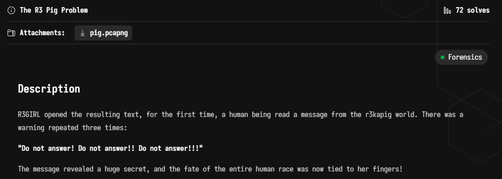

## The R3 Pig Problem - R3CTF Write-up



**Challenge:** The R3 Pig Problem
**Category:** Forensics
**Points:** 200
**Author:** MinousE3

### Introduction
In the R3CTF 2025 challenge “The R3 Pig Problem,” we were given a network capture file: [`pig.pcapng`](assets/files/pig.pcapng). The description set an ominous tone, hinting that the capture contained a cryptic and possibly dangerous message. The warning “Do not answer! Do not answer!! Do not answer!!!” was repeated three times, signaling urgency and importance.

The challenge hinted that the first human-readable message from the mysterious r3kapig world had surfaced—and it was up to us to extract it. Given the .pcapng file format, it was clear that this was a packet capture, most likely intended to be analyzed with tools like Wireshark or tshark.

The main goal was to analyze this packet capture and uncover the hidden message, potentially buried deep within protocol layers, obscure payloads, or covert channels. Like many forensic challenges, success hinged on methodical analysis, protocol awareness, and attention to detail.

With that, we moved into dissecting the contents of pig.pcapng to find what secrets the r3kapig world had left behind.

### Analyzing the [`pig.pcapng`](assets/files/pig.pcapng) File
The [`pig.pcapng`](assets/files/pig.pcapng) file provided for this challenge hinted at something hidden beneath the surface of seemingly ordinary network traffic. Loading the capture into Wireshark and applying the filter:
```bash
data.len > 0
```
quickly narrowed down the focus to a series of small TCP packets sent from ```192.168.0.24``` to ```192.168.0.16``` over port ```1337```. Each packet had a data length of exactly 1 byte, and their uniform structure strongly implied that they were part of a stream-based transmission.


To verify the content of the stream, I used the following command in the terminal:
```bash
tshark -r pig.pcapng -Y "tcp.port == 1337" -T fields -e data | xxd -r -p | strings
```
This pipeline extracts the raw hexadecimal payload from each TCP packet on port ```1337```, converts it to binary data, and then uses ```strings``` to extract human-readable ASCII content. The result revealed:
```bash
3.141592653589793238462643383279502884197169399375105820974944592307816406286208998628034825342117067982148086513282306647093844609550582231725359408128481117450284102701938521105559644622948954930381964428810975665933446128475648233786783165271201909145648566923460348610454326648213393607260249141273724587006606315588174881520920962829254091715364367892590360011330530548820466521384146951941511609433057270365759591953092186117381932611793105118548074462379962749567351885752724891227938183011949123.141592653589793238462643383279502884197169399375105820974944592307816406286208998628034825342117067982148086513282306647093844609550582231725359408128481117450284102701938521105559644622948954930381964428810975665933446128475648233786783165271201909145648566923460348610454326648213393607260249141273724587006606315588174881520920962829254091715364367892590360011330530548820466521384146951941511609433057270365759591953092186117381932611793105118548074462379962749567351885752724891227938183011949123.14159265358979323846264338327950288419716939937510582097494459230781640628620899862803482534211706798214808651328230664709384460955058223172535940812848111745028410270193852110555964462294895493038196442881097566593344612847564823378678316527120190914564856692346034861045432664821339360726024914127372458700660631558817488152092096282925409171536436789259036001133053054882046652138414695194151160943305727036575959195309218611738193261179310511854807446237996274956735188575272489122793818301194912EOF
```
The output contained the digits of π, repeated three times, followed by ```EOF```. At first glance, nothing in the payload appeared suspicious. No base64 strings, flags, or obfuscated data — just pure, unmodified π.

That observation — combined with the challenge name and the repeated “Do not answer!” clue — hinted that the actual flag might not be in the content at all. Instead, it might be hiding in the timing.

### Method
After confirming that the payload consisted only of digits of π, I shifted focus to the packet timestamps. Applying ```data.len > 0``` in Wireshark made it easier to observe the arrival times of each 1-byte TCP segment. A pattern quickly emerged: while the packet data remained static, the intervals between them varied — some were sent within milliseconds of one another, while others had notably larger gaps.

This led me to suspect a covert timing channel — a technique where the spacing between packets encodes binary data.

To test this theory, I extracted the relative arrival times of each packet using:

```bash
tshark -r pig.pcapng -Y "tcp.port == 1337 && data.len > 0" -T fields -e frame.time_relative
```

I then wrote a script named [`pigprobsolv.py`](assets/files/pigprobsolv.py) that:
1. Compute the time deltas between each packet.
2. Use a threshold (0.1 seconds) to classify each delta as a ```0``` or ```1```.
3. Group bits into 8-bit chunks.
4. Decode the result into ASCII characters.

Here’s the decoding script:
```bash
# Paste your timestamps here
timestamps = [
    12.960895285, 12.982466340, 13.084184544, 13.107136232, 
    13.132367350, 13.232912506, 13.338353937, ... ,
    104.623260923, 104.648284320, 104.668858319, 104.772011484, 
    104.796807009, 104.821918339, 104.845937020, 104.948356863
]

# 1️⃣ Compute time differences
deltas = [round(timestamps[i+1] - timestamps[i], 6) for i in range(len(timestamps) - 1)]

# 2️⃣ Use threshold to determine bits
threshold = 0.1
bits = ['1' if d > threshold else '0' for d in deltas]

# 3️⃣ Group bits into bytes and convert to characters
bit_string = ''.join(bits)
bytes_list = [bit_string[i:i+8] for i in range(0, len(bit_string), 8)]

# 4️⃣ Convert to ASCII
flag = ''
for byte in bytes_list:
    if len(byte) == 8:
        flag += chr(int(byte, 2))

print("Hidden message:", flag)
```

When I ran the script, it revealed the hidden flag:
```bash
minouse3@DESKTOP:~$ python3 pigprobsolv.py
Hidden message: My crazy army knows the pigs' secret! r3ctf{th3-thr33-b0dy-pr0blem-h4d-n0-solution} Do not answer! Do not answer!! Do not answer!!!My crazy army knows the pigs' secret! r3ctf{th3-thr33-b0d
```
The flag is embedded in a repeated, slightly chaotic message — consistent with the theme and name of the challenge. It clearly demonstrates a clever use of timing-based steganography, where content hides in the space between the bytes rather than in the bytes themselves.

```bash
Flag: r3ctf{th3-thr33-b0dy-pr0blem-h4d-n0-solution}
```
